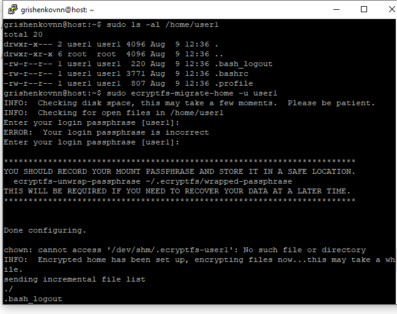
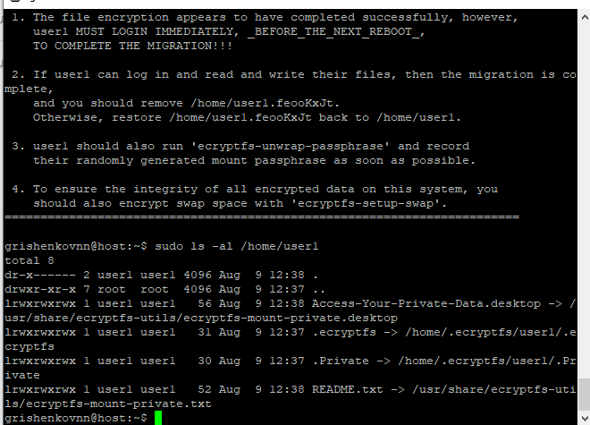
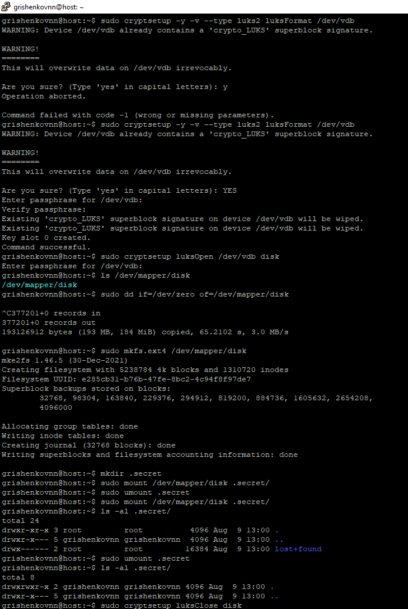

# Домашнее задание к занятию  «Защита хоста»

### Инструкция по выполнению домашнего задания

1. Сделайте fork [репозитория c шаблоном решения](https://github.com/netology-code/sys-pattern-homework) к себе в Github и переименуйте его по названию или номеру занятия, например, https://github.com/имя-вашего-репозитория/gitlab-hw или https://github.com/имя-вашего-репозитория/8-03-hw).
2. Выполните клонирование этого репозитория к себе на ПК с помощью команды `git clone`.
3. Выполните домашнее задание и заполните у себя локально этот файл README.md:
   - впишите вверху название занятия и ваши фамилию и имя;
   - в каждом задании добавьте решение в требуемом виде: текст/код/скриншоты/ссылка;
   - для корректного добавления скриншотов воспользуйтесь инструкцией [«Как вставить скриншот в шаблон с решением»](https://github.com/netology-code/sys-pattern-homework/blob/main/screen-instruction.md);
   - при оформлении используйте возможности языка разметки md. Коротко об этом можно посмотреть в [инструкции по MarkDown](https://github.com/netology-code/sys-pattern-homework/blob/main/md-instruction.md).
4. После завершения работы над домашним заданием сделайте коммит (`git commit -m "comment"`) и отправьте его на Github (`git push origin`).
5. Для проверки домашнего задания преподавателем в личном кабинете прикрепите и отправьте ссылку на решение в виде md-файла в вашем Github.
6. Любые вопросы задавайте в чате учебной группы и/или в разделе «Вопросы по заданию» в личном кабинете.

Желаем успехов в выполнении домашнего задания.

------

### Задание 1

1. Установите **eCryptfs**.
2. Добавьте пользователя cryptouser.
3. Зашифруйте домашний каталог пользователя с помощью eCryptfs.


*В качестве ответа  пришлите снимки экрана домашнего каталога пользователя с исходными и зашифрованными данными.*  

#### Ответ

```
sudo apt update
sudo apt install -y ecryptfs-utils

sudo adduser user1
sudo usermod -aG sudo user1


sudo ls -al /home/user1
sudo ecryptfs-migrate-home -u user1 #Миграция домашнего каталога пользователя cryptouser
sudo ls -al /home/user1
```

#### Скриншот выполнения ls -al /home/cryptouser до шифрования



#### Скриншот выполнения ls -al /home/cryptouser после шифрования



### Задание 2

1. Установите поддержку **LUKS**.
2. Создайте небольшой раздел, например, 100 Мб.
3. Зашифруйте созданный раздел с помощью LUKS.

*В качестве ответа пришлите снимки экрана с поэтапным выполнением задания.*

#### Ответ

```
apt list gparted cryptsetup #LUKS (gparted) и cryptsetup установлены по умолчанию
#sudo apt install -y gparted cryptsetup
cryptsetup --version

sudo fdisk -l
sudo cryptsetup -y -v --type luks2 luksFormat /dev/vdb #Подготавливаем раздел (luksFormat)
sudo cryptsetup luksOpen /dev/vdb disk #Открываем раздел
ls /dev/mapper/disk

sudo dd if=/dev/zero of=/dev/mapper/disk
sudo mkfs.ext4 /dev/mapper/disk

mkdir .secret 
sudo mount /dev/mapper/disk .secret/ #Монтируем раздел

sudo umount .secret
sudo cryptsetup luksClose disk #Закрываем раздел
```

#### Скриншот поэтапного выполнения




